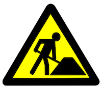

# PyRT - The Python Raytracer

PyRT is a raytracer written in Python 3.x. This project is mainly done with the following in mind:

  * Ray Tracing in Jupyter Notebook
  * Exploring ray tracing concepts for geo data using Python.
  * Rendering geo data, including large point clouds.
  * Implementing new algorithms for large 3D City Model rendering.
  * Creating 3D-Maps from OpenStreetMap data
  * ...

PyRT just started in July 2016, it is **not yet useable** it is **work in progress**. The first running version will be available **later in July**.

<p align="center">
  
</p>

## Dependencies

PyRT doesn't have any dependencies at the moment. Generated images are just RGB or RGBA Arrays. To create jpg or png or other images, many demos use Pillow (PIL). So it is highly recommended to install it.

## Creating Scenes

PyRT is *not* a 3D-Modelling package. It is all about rendering from code.

In PyRT you create a scene first. Scenes consist of atleast one camera and geometry. Creation of scenes is done in an object oriented way:

```python
from pyrt.math import *
from pyrt.geometry import Triangle
from pyrt.camera import PerspectiveCamera
from pyrt.renderer import SimpleRT

camera = PerspectiveCamera(640,480)
scene = Scene()
scene.Add(Triangle(Vec3(0, 0, 0), Vec3(0, 5, 0), Vec3(1, 5, 0)))
scene.SetCamera(camera)

engine = renderer.SimpleRT()

imgdata = engine.render(scene)
```

PyRT has an open rendering concept, you can create **your own renderer**. In the example above "SimpleRT" was used, which is a minimalistic raycaster.

## Python & RayTracing, isn't that too slow ?

No. Custom rendererers can be written in C with Python bindings. This is planned in future, later versions will even support the GPU using OpenCL and/or other libraries, but at the moment the primary focus is to create a pythonic interface to scenegraph based ray tracing.

## License

PyRT is released under GPLv3. 
More information about this license can be found under: [https://www.gnu.org/licenses/gpl-3.0.en.html]()

## Author

PyRT is created and maintained by Martin Christen. You can contact me by e-mail: martin.christen@gmail.com


## Support this project!

There are several ways to support this project, constribute, test, document, ...

Some Contribution examples:

* Contribute: implement new renderers
* Contrubute: support new geometry types 
* Contribute: implement new lighting models


