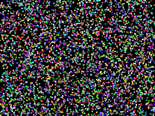
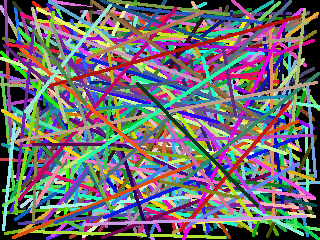
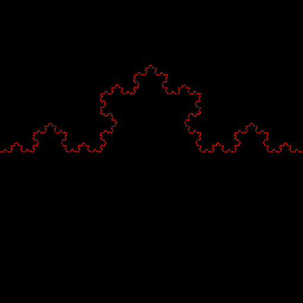
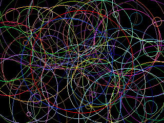
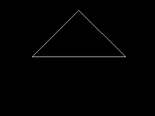
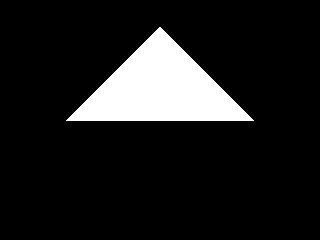
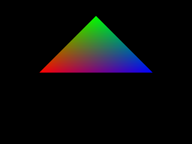
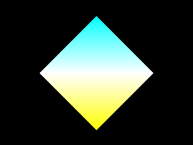
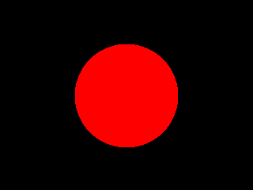

# pyRT Examples

For the examples you need "pillow" installed. This can be done using pip.
Some examples generate animated gif, for that you need the moviepy module. Please note that moviepy has a lot of dependencies - for example numpy - which are also installed.

    pip install Pillow
    pip install moviepy
    
or by running this Python code:

    import pip
    pip.main(['install', 'Pillow'])
    pip.main(['install', 'moviepy'])

## Using 'pyrt.image'

The first series of examples is just about images and drawing into them.
It is important to understand the concept of an "image generator". 
While most graphics applications draw something on the screen, in pyRT there is no interactive window displaying anything.
Images are for example generated as list of RGB tuples, which are then stored as an image in a common format like PNG. 

### Drawing Points

[00_drawpoints.py](00_drawpoints.py)

This example creates an image and draws 5000 random points using image.drawPoint(point,color)

The image is stored using pillow.

### Drawing Lines

[01_drawlines.py](01_drawlines.py)

This example draws 500 random lines using using image.drawLine(start, end, color). Drawing lines is done using the <a href="https://en.wikipedia.org/wiki/Bresenham%27s_line_algorithm" target="_blank">Bresenham line drawing algorithm</a>.

<cite>J. E. Bresenham. 1965. Algorithm for computer control of a digital plotter. IBM Syst. J. 4, 1 (March 1965), 25-30. DOI=http://dx.doi.org/10.1147/sj.41.0025</cite>

### Drawing Koch curve

[02_snowflake.py](02_snowflake.py)

This example draws a Koch curve using recursion. It is just another example how line drawing can be used.

### Drawing Circles

[03_circle.py](03_circle.py)

This example draws 100 random circles using  image.drawCircle(center, radius, color). Drawing lines is done using the <a href="https://en.wikipedia.org/wiki/Midpoint_circle_algorithm" target="_blank">Midpoint circle algorithm</a>.

### Drawing Rectangles

[04_rectangle.py](04_rectangle.py)

This example draws 50 random rectangles using image.drawRectangle(bottomleft, width, height, color).

## Introduction to 3D Math

### Drawing a triangle in 3D

[05_triangle3d.py](05_triangle3d.py)

This example shows how a projection matrix and the viewing transformation is used to render a (wireframe) 3D triangle on the image.

### Drawing an animated triangle in 3D

[06_triangle3danim.py](06_triangle3danim.py)

This example generates an animated gif by moving the camera (changing the view matrix). The movie is created using moviepy module which is required to run this example.

## Raytracing

### Create a scene with a triangle

[07_raytracingtriangle.py](07_raytracingtriangle.py)

This example creates a scene with the same triangle like in example 5. Then it renders it using the SimpleRT raytracer.

### Raytrace triangle with different vertex colors

[08_raytracingtriangle_colorvertex.py](08_raytracingtriangle_colorvertex.py)

This example adds a triangle with different vertex colors to the scene.

### Multiple triangles

[09_multiple_triangles.py](09_multiple_triangles.py)

This example renders two triangles

### Rendering a sphere

[10_sphere.py](10_sphere.py)

This example renders a sphere

